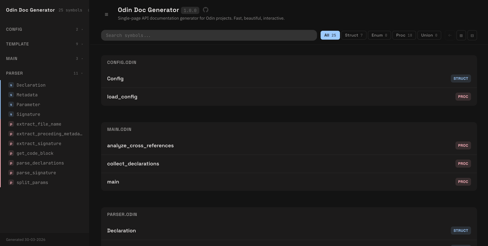

# Odin Doc Generator

Single-page, designed with modern and familiar tones, API documentation generator for Odin projects.



## Features

- 📄 **Single-page output** — One clean HTML file with everything bundled
- 🎨 **Modern design** — Beautiful dark theme with customizable colors
- 🔍 **Interactive sidebar** — Instant navigation and search across all symbols
- 🏷️ **Cross-references** — Click to jump between related declarations
- ✨ **Syntax highlighting** — Color-coded Odin code with proper scoping
- 📱 **Responsive** — Perfect on mobile, tablet, and desktop
- ⚡ **Fast** — Generates complete docs in milliseconds
- 🎯 **Smart sorting** — Organize by file, type (struct/enum/proc/union), and name

## Quick Start

```bash
# Build
odin build .

# Generate docs
./odin-doc-generator --dir ./src --config ./config.json --embed

# Open in browser
open index.html
```

That's it. One HTML file with your entire API.

## Configuration

Create `config.json`:

```json
{
  "project": {
    "name": "My Project",
    "version": "1.0.0",
    "description": "What your project does",
    "repository": "https://github.com/user/project"
  },
  "paths": {
    "source_dir": ".",
    "output_html": "./index.html",
    "template_dir": "./template",
    "style_css": "./template/style.css",
    "theme_css": "./template/themes/dracula.css",
    "syntax_json": "./odin_syntax.json"
  },
  "sort_order": {
    "STRUCT": 1,
    "ENUM": 2,
    "PROC": 3,
    "UNION": 4
  }
}
```

## Writing Documentation

Add doc comments above your declarations:

```odin
// Loads configuration from a file
// Returns error if file not found
load_config :: proc(path: string) -> Config {
    // ...
}
```

Comments are automatically extracted and displayed in the sidebar preview.

## CLI Options

```bash
./odin-doc-generator [options]

Options:
  --dir DIR       Source directory (default: .)
  --config FILE   Config file path (default: ./config.json)
  --embed         Embed CSS inline (no external files)
```

## Features in Detail

### Interactive Declarations
- Click to expand/collapse any symbol
- Doc comments show in previews
- Parameter types are linked
- "Used by" shows where symbols are referenced

### Smart Cross-References
- Function calls are automatically linked
- Jump to any symbol with one click
- Circular references handled properly
- Same-name symbols grouped by file

### Default Theme
- Obsidian

Switch themes in `config.json`:
```json
"theme_css": "./template/themes/obsidian.css"
```

## Project Structure

```
odin-doc-generator/
├── main.odin           # Entry point, CLI handling
├── config.odin         # Config loading
├── parser.odin         # Odin parsing, regex extraction
├── template.odin       # HTML generation, TOC building
├── config.json         # Your project config
├── odin_syntax.json    # Syntax rules for highlighting
└── template/
    ├── template.html   # Main HTML template
    ├── style.css       # Base styles
    └── themes/
        └── obsidian.css
```

## How It Works

1. **Parse** — Regex-based extraction of declarations from Odin files
2. **Analyze** — Cross-reference detection, doc comment extraction
3. **Organize** — Sort by file → type → name
4. **Render** — Generate HTML with syntax highlighting
5. **Bundle** — Create single-file output with embedded styles

All in ~100ms for typical projects.

## Acknowledgments

Inspired by:
- [Odin's official documentation generator](https://github.com/odin-lang/pkg.odin-lang.org)
- [Odin Doc Gen by Parven05](https://github.com/Parven05/Odin-Doc-Gen)

Got most of the features I like about the official solution, with the cool design of Parven05's solution

## License

MIT License — See [LICENSE](./LICENSE) file

Permission to use, modify, and distribute freely. See LICENSE for details.

## Author

Hello! I trust in odin's future. I think you should too.

---

**Ready to document your project?**

```bash
git clone https://github.com/DarthMarino/odin-doc-generator
cd odin-doc-generator
odin build . && ./odin-doc-generator
```
